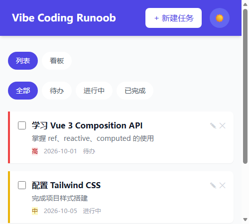
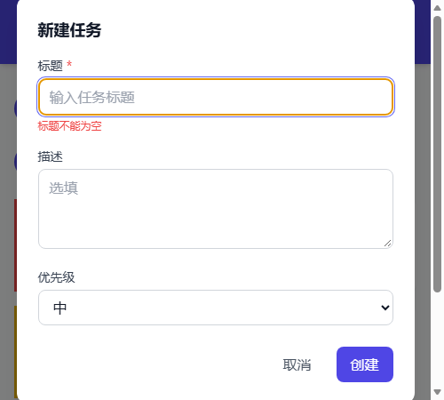
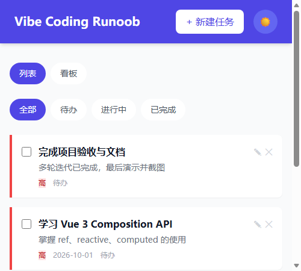
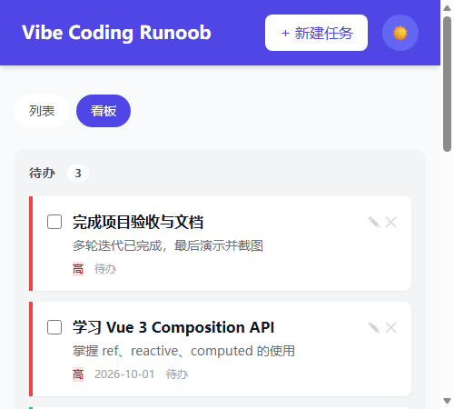
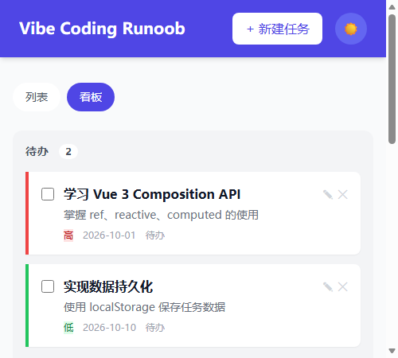
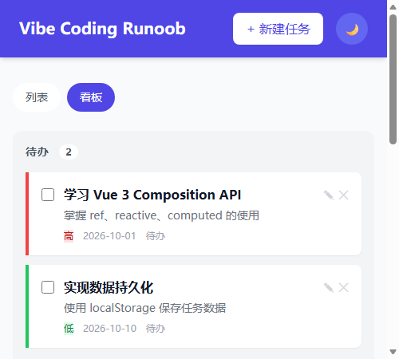

# Vibe Coding Runoob — 任务管理应用

基于 [RUNOOB Vibe Coding 实践指南](https://www.runoob.com/vibe-coding/vibe-coding-practice.html) 构建的完整任务管理 Web 应用。

## 技术栈

| 用途     | 技术              |
| -------- | ----------------- |
| 前端框架 | Vue 3（Composition API / `<script setup>`） |
| 构建工具 | Vite 5            |
| 样式方案 | Tailwind CSS v3   |
| 单元测试 | Vitest 2 + jsdom  |
| 数据存储 | 浏览器 localStorage |

## 项目结构

```
vibe-coding-runoob/
├── index.html
├── package.json
├── vite.config.js
├── tailwind.config.js
├── postcss.config.js
├── public/
├── screenshots/              # 真实浏览器演示截图
├── docs/
│   └── prompts.md            # 多轮迭代提示词过程
├── src/
│   ├── main.js
│   ├── App.vue
│   ├── types/task.ts
│   ├── components/
│   │   ├── TaskCard.vue
│   │   ├── TaskList.vue
│   │   ├── TaskModal.vue
│   │   ├── KanbanBoard.vue
│   │   └── ThemeToggle.vue
│   ├── stores/
│   │   └── taskStore.ts
│   └── utils/
│       ├── storage.ts
│       └── storage.test.ts
└── scripts/
    ├── demo-cdp.mjs          # 真实浏览器演示 + 截图脚本
    └── debug-page.mjs        # CDP 诊断脚本
```

## 快速开始

```bash
npm install
npm run dev      # 启动开发服务器，默认 http://localhost:5173
```

## 功能列表

- [x] 创建、编辑、删除任务
- [x] 任务字段：标题（必填）、描述（选填）、优先级、状态、创建时间
- [x] 任务状态：待办 / 进行中 / 完成
- [x] 优先级：高（红）、中（黄）、低（绿）
- [x] 列表视图：筛选全部/待办/进行中/已完成，按创建时间倒序
- [x] 看板视图：三列拖拽卡片改状态
- [x] 深色模式切换并记住偏好
- [x] 数据自动持久化到 `localStorage`，刷新不丢失
- [x] 响应式布局，支持移动端

## 功能演示截图

截图由 Edge headless（CDP）自动驱动应用生成，保存在 `screenshots/`。

### 1. 默认任务列表



### 2. 新建任务弹窗校验



### 3. 新建任务后


### 4. 刷新后（持久化验证）



### 5. 看板视图



### 6. 拖拽改状态后



### 7. 深色模式



## 验证结果

### 单元测试

```bash
npx vitest run
```

```text
 Test Files  8 passed (8)
      Tests  40 passed (40)
 Duration  1.59s
```

### 生产构建

```bash
npm run build
```

```text
vite v5.4.21 ✓ 17 modules transformed.
dist/                     0.52 kB │ gzip: 0.35 kB
assets/index-*.css       14.51 kB │ gzip: 3.41 kB
assets/index-*.js        83.13 kB │ gzip: 32.43 kB
```

### 真实浏览器演示

脚本：`node scripts/demo-cdp.mjs 9222 .edge-tmp screenshots`

结果：7 张截图全部生成，标题校验、localStorage 持久化、拖拽状态迁移、深色模式切换均验证通过。

## 多轮迭代提示词过程

详细的提示词过程与提交对应关系见 [`docs/prompts.md`](./docs/prompts.md)。

主要迭代：

1. 第 1 轮：Vue 3 + Vite + Tailwind v3 骨架
2. 第 2 轮：任务列表 + 新建/编辑弹窗
3. 第 3 轮：localStorage 持久化（含刷新降级保护）
4. 第 4 轮：看板视图 + 拖拽改状态
5. 第 5 轮：深色模式 + 移动端适配
6. 第 6 轮：测试、构建、真实浏览器演示截图、README 与提示词文档整理

## 参考

- [RUNOOB Vibe Coding 实践指南](https://www.runoob.com/vibe-coding/vibe-coding-practice.html)
